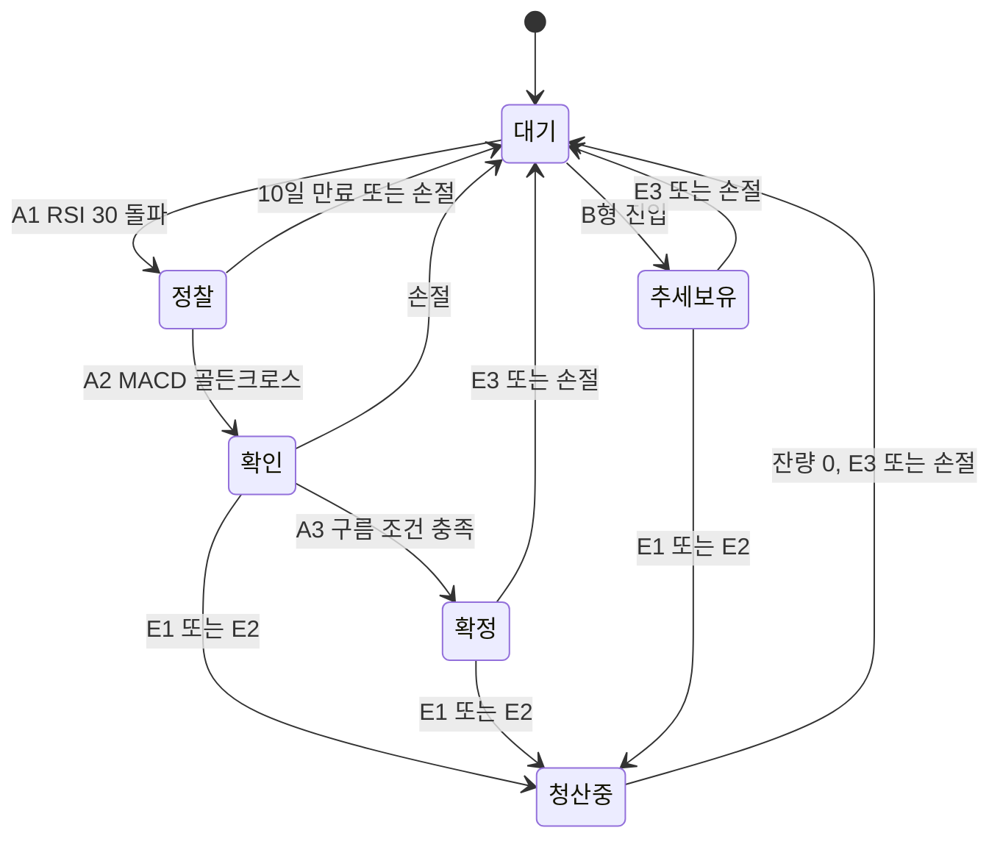

# MACD 중심 통합 매매 전략 v3 — 나스닥 100 스크리너 최종 정리본

작성일: 2026-09-23 · 버전: v3 최종

---

## 1. 전략 개요

최종 전략은 **RSI 30 탈출 → MACD 골든크로스 → 일목 구름 확정** 순서로 신호가 겹칠 때마다 비중을 1:2:6으로 늘리는 롱 전용 전략이다. 모든 조건은 일봉 OHLCV 데이터만으로 계산할 수 있다.

| 항목 | 내용 |
| --- | --- |
| 목적 | 나스닥 100 종목 중 상승 추세로 전환하는 종목을 매일 선별하고 단계별 알림 |
| 대상 | 나스닥 100 구성 종목 (분기 리밸런싱 반영) |
| 시간봉 | 일봉, 미국장 마감 후 확정된 봉만 사용 |
| 방향 | 롱 전용 (공매도 없음) |
| 매매 방식 | 수동 매매 (브리핑 확인 후 직접 주문) |
| 알림 | 텔레그램 봇, 하루 1회 일일 브리핑 |

### 최종 지표 조합

| 역할 | 지표 | 설정 |
| --- | --- | --- |
| 기준 (방향 확정) | MACD | 12, 26, 9 |
| 타이밍 (선행 경고) | RSI | 14, 기준선 30 / 50 / 70 |
| 검증 (힘의 크기) | 거래량 | 20일 평균 대비 배수 |
| 추세 필터 · 최종 청산 | 일목 구름 + 후행스팬 | 9 / 26 / 52 |
| 보조 필터 (선택) | 볼린저밴드 밴드폭 | 20, 2 |

### 핵심 원칙

- 가격이 내려갈 때 사는 것이 아니라, **신호가 겹칠 때** 비중을 늘린다. 물타기는 금지한다.
- 진입과 청산 모두 신호 기준으로 단계적으로 움직인다.
- 한 번의 거래에서 잃을 수 있는 최대 금액은 계좌의 2%다.
- 추세장에서 RSI 70 이상은 매도 신호가 아니다. 추세 약화는 RSI 50 이탈로 판단한다.

---

## 2. 후지모토 1:2:6 전략 평가

1:2:6은 이 스크리너의 **포지션 관리 뼈대로 채택**한다. 사용자의 핵심 전략(RSI → MACD 순서)과 구조가 같고, 각 단계가 그대로 알림 단위가 되기 때문이다. 출처는 MACD_11번 대본이다.

| 구분 | 내용 |
| --- | --- |
| 장점 1 | 신호가 겹칠수록 비중을 키워서, 확률이 가장 높은 자리에 가장 큰 금액이 들어간다 |
| 장점 2 | 첫 진입이 틀려도 손실이 작다 (전체의 약 11%) |
| 장점 3 | 청산도 1 → 2 → 6 순서라 수익을 단계적으로 확보한다 |
| 약점 1 | 비중 6은 가격이 이미 오른 뒤 들어가므로 평균 단가가 높아진다 |
| 약점 2 | "손절 없는 매매"라는 주장은 위험하다. 고정 손절은 반드시 둔다 |
| 약점 3 | 3단계까지 완성되지 않는 거래가 많아 소액 수익으로 끝나는 경우가 잦다 |
| 약점 4 | 대본 요약부와 실제 시연부의 청산 순서가 서로 다르다 |

### 채택 시 수정 사항

1. **비중 정규화**: 1:2:6은 합이 9이므로 각각 11% / 22% / 67%로 쓴다.
2. **고정 손절 추가**: 각 단계마다 손절선을 두고, 단계별 위험 예산으로 수량을 계산한다 (6장).
3. **단계 유효기간**: 1단계 후 10거래일 안에 2단계가 없으면 신호를 만료한다.
4. **청산 순서 확정**: 시연부 기준으로 MACD 데드크로스 → RSI 50 이탈 → 구름 이탈 순서를 쓴다.
5. **롱 전용**: 대본의 공매도 시연은 제외한다.

---

## 3. 지표 설정

스크리너에는 일봉 OHLCV로 정확히 계산되는 지표만 넣고, 사람의 해석이 필요한 요소는 모두 제외한다.

### 사용 지표

| 지표 | 설정값 | 계산 재료 | 용도 |
| --- | --- | --- | --- |
| MACD | 12, 26, 9 | 종가 | 골든·데드크로스, 0선 위치, 히스토그램 |
| RSI | 14 (Wilder 방식) | 종가 | 30 탈출, 50 이탈, 70 과열 |
| 거래량 평균 | 20일 | 거래량 | 신호일 거래량 배수 |
| 일목 전환선·기준선 | 9, 26 | 고가·저가 | 기준선 이탈 경고 |
| 일목 구름 | 선행 A, 선행 B(52) | 고가·저가 | 추세 필터, 최종 청산 |
| 일목 후행스팬 | 26 | 종가, 고가 | 추세 확정 |
| 스윙 저점 | 최근 10일 최저가 | 저가 | 손절선 |
| 볼린저 밴드폭 (선택) | 20, 2 / 120일 백분위 | 종가 | 횡보장 판별 |

### 제외 항목 (수동 확인용)

| 항목 | 제외 이유 |
| --- | --- |
| 전환선·기준선 교차(호전) | MACD 골든크로스와 정보가 겹치고, 단독 성과가 낮다 [일목 06] |
| 이동평균선 골든크로스 | MACD의 재료 자체라 중복이다 |
| 추세선, 지지·저항선 | 긋는 사람마다 다르다 |
| 다이버전스 | 고점·저점 판정 규칙이 필요해 2차 버전에서 검토한다 |
| 후행스팬 공간 해석, N파 | 해석 의존도가 높다 |
| 캔들 패턴(도지, 장악형) | 1차 버전에서는 제외한다 |

데이터는 종목당 최소 200거래일(권장 300거래일)을 받는다. 일목 선행 B와 26일 이동을 합치면 최소 78거래일이 필요하고, EMA는 초기값이 안정되는 데 시간이 걸리기 때문이다.

---

## 4. 진입 규칙

진입은 A형(바닥 반전, 3단계)과 B형(추세 재진입, 1회) 두 가지다. 모든 판정은 당일 종가 확정 후 하고, 매수는 다음 거래일에 종가 × 1.01 이하 지정가로 넣는다 (11장).

### A형: 바닥 반전 (1:2:6)

| 단계 | 비중 | 조건 (모두 충족) | 근거 |
| --- | --- | --- | --- |
| A1 정찰 | 1 (11%) | RSI가 전일 30 미만에서 당일 30 이상으로 상향 돌파 | M11, M12 |
| A2 확인 | 2 (22%) | A1 후 10거래일 이내 (A1 당일 포함) MACD 골든크로스 발생, RSI 30 이상 70 미만 유지<sup>[해석]</sup> | M10, M11, M12 |
| A3 확정 | 6 (67%) | A2 포지션 보유 중 아래 4가지 동시 충족 | M11, 일목 01·04·05·09 |

A3 확정의 4가지 조건은 다음과 같다.

1. 종가 > 오늘 가격 아래 구름의 상단
2. 앞구름 양운: 오늘 계산한 선행 A > 선행 B
3. 후행스팬 돌파: 오늘 종가 > 26거래일 전 고가
4. 모멘텀 유지: MACD > 시그널, RSI 50 이상 [확장]

A3 진입 방식은 두 가지 중 하나를 설정값으로 고른다. **(미결정: 백테스트 후 확정)**

| 방식 | 트리거 | 장단점 |
| --- | --- | --- |
| 돌파형 (기본값) | 위 4가지가 처음 모두 충족된 날 | 신호를 놓치지 않지만 윗꼬리에 물릴 수 있다 [일목 03·05] |
| 되돌림형 | 4가지 충족 상태에서 저가가 구름 상단 또는 기준선의 0.5% 이내까지 내려왔다가 양봉으로 마감 | 승률이 높지만 되돌림 없이 오르면 놓친다 [일목 01·06·09] |

갭 필터: 당일 시가가 전일 종가보다 4% 이상 높으면 A3 진입을 건너뛴다 [일목 03, 수치는 가정].

**[해석, P2.1 보완 2번]** A2의 "RSI 30 이상 70 미만 유지"는 **A2 판정 당일**의
RSI만 본다. A1 이후 중간에 RSI가 다시 30 아래로 내려간 날이 있어도 A1을
무효로 하지 않는다 — 그 구간의 하락 위험은 5장 손절 규칙(A1 발생일 기준
swing_low 이탈 시 전량 매도)이 이미 관리하기 때문이다. 구현: `core/signals.py`
`check_a2()`.

### B형: 추세 재진입 (1회 진입)

이미 상승 추세에 있는 종목의 눌림 후 재상승을 잡는다. A1이 없어도 된다.

| 조건 | 기준 | 근거 |
| --- | --- | --- |
| 추세 확인 | 종가 > 구름 상단, 앞구름 양운, 후행스팬 돌파 | 일목 01·04·08 |
| MACD | 골든크로스, 정규화 MACD가 -0.5% 이상 (0선 근처 또는 위) | M06, M09, M12 |
| RSI | 50 이상 70 미만 | M10, M12 |
| 위험 예산 | 계좌의 1% (A형의 절반) [가정] | 바닥 확인이 없어 보수적으로 설정 |

RSI가 70 이상인 날의 골든크로스는 진입하지 않는다. 대신 RSI가 50 부근까지 눌렸다가 다시 오르는 날을 B형 후보로 본다 [M10].

---

## 5. 청산·손절 규칙

청산은 진입과 같은 1 → 2 → 6 묶음 단위로 한다. 각 청산 신호는 자기 묶음만 팔고, 손절은 모든 신호보다 우선한다. A형과 B형 모두 같은 규칙을 쓴다 (B형은 9단위로 간주).

### 단계별 청산

| 신호 | 조건 (종가 기준) | 매도 묶음 | 근거 |
| --- | --- | --- | --- |
| E1 모멘텀 약화 | MACD 데드크로스 | 1 | M11 |
| E2 추세 약화 | RSI가 전일 50 이상에서 당일 50 미만 | 2 | M10, M11 |
| E3 구조 붕괴 | 종가 < 오늘 가격 아래 구름의 하단, 또는 후행스팬 < 선행 B | 6 | M11, 일목 04 |

신호 순서가 바뀌어도 된다. 예를 들어 RSI 50 이탈이 먼저 오면 묶음 2를 먼저 판다. 이미 판 묶음의 신호는 무시한다.

### 손절 (최우선)

| 상황 | 손절 조건 | 매도 |
| --- | --- | --- |
| A1 ~ A2 보유 중 | 종가 < A1 발생일 기준 최근 10거래일 최저가 | 전량 |
| A3 보유 중 | 위 조건, 또는 E3 발생 | 전량 |
| B형 보유 중 | 종가 < 진입일 기준 최근 10거래일 최저가 | 전량 |
| A1 만료 | A1 후 10거래일 안에 A2가 없음 [가정] | 묶음 1 |

### 알림만 보내는 경고

- 기준선 이탈: 종가가 일목 기준선 아래로 마감 [일목 01·05·06]. 일목 단독 전략에서는 청산 신호지만, 이 전략에서는 E3 전 조기 경보로만 쓴다.
- RSI 과열 해소: RSI가 70 이상이었다가 70 아래로 내려옴 [M11]. 매도 신호가 아니다.
- 목표 도달: 평균 매수가 기준 손익비 2배 도달 [M05·M07·M10]. 부분 익절 여부는 사용자가 판단한다.

원안의 "RSI 70 진입 시 매도"는 채택하지 않는다. M10·M11·M12가 모두 추세장의 RSI 70 이상을 보유 근거로 본다.

---

## 6. 포지션 크기: 2% 룰의 단계별 배분

한 종목의 총 위험은 계좌의 2%로 제한하고, 이 예산을 1:2:6 비율로 나눠 단계마다 수량을 계산한다 [M11]. 이렇게 하면 모든 단계가 손절돼도 손실이 2%를 넘지 않는다.

| 단계 | 위험 예산 (계좌 대비) | 손절 기준 |
| --- | --- | --- |
| A1 | 0.22% | 10일 최저가 |
| A2 | 0.44% | 10일 최저가 |
| A3 | 1.33% | 10일 최저가와 구름 하단 중 높은 값 |
| B형 | 1.00% | 10일 최저가 |

```
수량 = 내림( 계좌 × 단계 위험 예산 ÷ 주당 위험 )
주당 위험 = (매수가 − 손절가) + 매수가 × 1.5%   ← 갭 여유 (수동 매매)
```

갭 여유(매수가 × 1.5%)는 손절이 하락 갭으로 밀려도 총손실이 2%를 넘지 않게 하기 위한 값이다 (11장).

### 계산 예시 (계좌 10만 달러, 갭 여유 제외)

| 단계 | 진입가 | 손절가 | 주당 위험 | 위험 예산 | 수량 |
| --- | --- | --- | --- | --- | --- |
| A1 | $100 | $94 | $6 | $222 | 37주 |
| A2 | $103 | $94 | $9 | $444 | 49주 |
| A3 | $115 | $106 (구름 하단) | $9 | $1,333 | 148주 |

A3 이후에는 손절선이 $106으로 올라가므로 A1·A2 물량은 손실 구간을 벗어난다. 따라서 실제 최대 손실은 A3 물량의 $1,333 이하다.

### 추가 한도 [가정]

- 종목당 투입 금액: 계좌의 25% 이하
- 동시 보유 종목: 최대 8개
- 주당 위험이 진입가의 1% 미만이면 손절선이 너무 가까운 것이므로 수량 계산 시 1%를 최소값으로 쓴다.

---

## 7. 필터와 신호 등급

신호가 여러 개 나온 날에는 점수 순으로 정렬해서 상위 종목부터 알림한다 [M08]. 등급은 MACD 골든크로스가 0선에서 얼마나 가까운지로 정한다 [M12].

### A2·B형 등급

정규화 MACD = MACD ÷ 종가 × 100 (종목 가격 차이를 없애기 위한 값)

| 등급 | 브리핑 표기 | 조건 | 의미 |
| --- | --- | --- | --- |
| S | 신뢰 높음 | 정규화 MACD가 -0.5% 이상 | 0선 근처 골든크로스, 힘이 가장 강함 |
| A | 신뢰 보통 | -2.0% 이상 -0.5% 미만, 최근 20거래일 첫 골든크로스 | 일반적인 바닥 반전 |
| B | 신뢰 낮음 | -2.0% 미만, 또는 최근 20거래일 골든크로스 2회 이상 | 힘이 약함, 목표 수익 5~10%로 짧게 [M12] |

### 우선순위 점수 (100점)

| 항목 | 배점 | 근거 |
| --- | --- | --- |
| 등급 | S 40 / A 25 / B 10 | M12 |
| 신호일 거래량 ÷ 20일 평균 | 1.5배 이상 25 / 1.2배 이상 15 | M07, M09 |
| 위쪽 구름 두께 ÷ 종가 | 3% 이하 20 / 6% 이하 10 | 일목 01·03·08 (얇은 구름은 돌파가 쉽다) |
| 볼린저 밴드폭 120일 백분위 | 20% 이하 15 | 볼린저 01·03 (수축 후 변동성 확대) |

### 매매 금지 구간

| 조건 | 적용 단계 | 근거 |
| --- | --- | --- |
| 골든크로스 당일 RSI 70 이상 | A2, B | M10 |
| 종가가 구름 안에 있음 | A3, B | 일목 01·02·04 |
| 앞구름 음운 | A3, B | 일목 04·09 |
| 최근 20거래일 MACD 교차 4회 이상 (횡보 휩소) | A2, B | M07, 볼린저 06 |
| 당일 시가 갭 4% 이상 | A3 | 일목 03 |
| 실적 발표 3거래일 이내 (필수, 11장) | 전체 | 수동 매매 갭 위험 회피 [확장] |

A1·A2는 가격이 구름 아래에 있어도 허용한다. 비중이 전체의 33%로 작고, 본 진입(67%)은 구름 위에서만 하기 때문이다. "구름 아래 종목은 보지 말라"는 일목 04번 원칙과의 절충이다.

---

## 8. 상태 전이 (단계 관리)

종목마다 현재 단계를 저장해 두고, 매일 그 단계에서 가능한 신호만 검사한다. 같은 알림이 반복되지 않게 하는 핵심 장치다.



청산 신호가 한 번이라도 나오면(청산중) 그 종목은 더 이상 추가 매수하지 않는다. 대기로 돌아온 종목은 5거래일이 지나야 새 A1을 받는다 [가정].

### 종목별 저장 항목

| 필드 | 예시 | 용도 |
| --- | --- | --- |
| ticker | NVDA | 종목 코드 |
| name_kr | 엔비디아 | 브리핑 표기용 한글 이름 |
| state | 확인 | 현재 단계 |
| units | {1: 37, 2: 49, 6: 0} | 묶음별 보유 수량 |
| entries | {1: 100.0, 2: 103.0} | 묶음별 진입가 |
| stop | 94.0 | 현재 손절가 |
| a1_date | 2026-09-10 | A2 유효기간 계산 |
| cooldown_until | 2026-09-30 | 재진입 대기 종료일 |
| sent_alerts | ["A1:2026-09-10"] | 중복 알림 방지 키 |

저장소는 1차 버전에서 SQLite 파일 하나로 충분하다. 실제 매수·매도는 사용자가 하므로, 저장된 수량은 추천 수량이며 체결 후 수정할 수 있어야 한다.

---

## 9. 지표 계산식과 미래 데이터 방지

모든 조건은 오늘까지의 데이터만 쓴다. 차트는 일목 선을 앞뒤로 옮겨 그리지만, 스크리너는 과거 값을 오늘로 끌어와 비교해야 한다.

```python
# 입력: 일봉 DataFrame (open, high, low, close, volume), 날짜 오름차순
D = 26  # 일목 이동 칸수. 트레이딩뷰와 맞추려면 25 (아래 설명)

ema12, ema26 = close.ewm(span=12, adjust=False).mean(), close.ewm(span=26, adjust=False).mean()
macd   = ema12 - ema26
signal = macd.ewm(span=9, adjust=False).mean()
gc = (macd.shift(1) <= signal.shift(1)) & (macd > signal)   # 골든크로스
dc = (macd.shift(1) >= signal.shift(1)) & (macd < signal)   # 데드크로스
macd_norm = macd / close * 100

delta = close.diff()
gain  = delta.clip(lower=0).ewm(alpha=1/14, adjust=False).mean()
loss  = (-delta.clip(upper=0)).ewm(alpha=1/14, adjust=False).mean()
rsi   = 100 - 100 / (1 + gain / loss)

tenkan = (high.rolling(9).max()  + low.rolling(9).min())  / 2
kijun  = (high.rolling(26).max() + low.rolling(26).min()) / 2
span_a = (tenkan + kijun) / 2                                  # 오늘 계산 = 앞구름
span_b = (high.rolling(52).max() + low.rolling(52).min()) / 2

cloud_top = np.maximum(span_a, span_b).shift(D)   # 오늘 가격 아래의 구름
cloud_bot = np.minimum(span_a, span_b).shift(D)
future_yang   = span_a > span_b                    # 앞구름 양운
chikou_ok     = close > high.shift(D)              # 후행스팬 돌파
chikou_broken = close < span_b.shift(2 * D)        # 후행스팬 < 선행 B (E3)

vol_ratio  = volume / volume.rolling(20).mean()
swing_low  = low.rolling(10).min()
bb_mid, bb_sd = close.rolling(20).mean(), close.rolling(20).std()
bb_width_pct = (4 * bb_sd / bb_mid).rolling(120).rank(pct=True)

# 금지: close.shift(-D) 처럼 음수 shift는 미래 데이터를 쓴다
```

### 구현 주의점

- **이동 칸수**: 트레이딩뷰는 26일 이동을 실제로 25칸으로 그린다. 알림과 차트가 하루씩 어긋나면 D를 25로 바꾼다. 첫 배포 전에 5개 종목을 차트와 대조한다.
- **RSI 방식**: Wilder 평활(alpha = 1/14)을 쓴다. 단순 이동평균 방식과는 값이 1~3 정도 다를 수 있다.
- **미완성 봉 금지**: 장중 데이터가 섞이면 신호가 바뀐다. 미국장 마감 후 확정된 일봉만 쓴다.
- **수정 주가**: 액면분할이 가격 지표를 왜곡하지 않도록 수정 주가(분할 반영)를 쓴다.

---

## 10. 텔레그램 알림 설계

알림은 하루 한 번 **일일 브리핑** 한 통으로 보낸다. 맨 위에 오늘 할 일 건수를, 그 아래에 행동할 종목을 신호별 그룹으로 적고, 스크리닝 단계별 종목 수는 맨 아래 참고로 둔다.

### 브리핑 구성

| 순서 | 블록 | 내용 |
| --- | --- | --- |
| 1 | 헤더 | 날짜, 미국장 마감 기준 |
| 2 | 오늘 할 일 | 매수·매도·손절 건수 한 줄 요약 |
| 3 | 긴급 손절 | 손절 종목이 있을 때만 표시 |
| 4 | 매수 | 신호별 그룹. 1차 → 2차 → 3차 → 추세 재진입 순 |
| 5 | 매도 | 신호별 그룹. 전량 매도 → 2차 물량 → 1차 물량 순 |
| 6 | 확인만 | 매도가 아닌 경고 (기준선 이탈 등) |
| 7 | 참고 | 보유 현황, 스크리닝 단계별 종목 수 |

시스템 오류(데이터 수집 실패 등)만 브리핑과 별도로 즉시 보낸다.

### 메시지 템플릿 (확정)

```
나스닥100 브리핑
9월 17일(수) 미국장 마감

[오늘 할 일]
매수 3 · 매도 2 · 손절 0

━━━ 매수 ━━━
※ 가격 이하로 지정가 매수

1차 · RSI 30 탈출 (2)
테슬라 251 / 12주 / 손절 235
인텔 24.2 / 80주 / 손절 22.5

2차 · 골든크로스 (1)
구글 166 / 20주 / 손절 158

━━━ 매도 ━━━
※ 다음 장 시작 후 매도

2차 물량 · RSI 50 이탈 (1)
아마존 30주

1차 물량 · 데드크로스 (1)
마이크로소프트 15주

━━━ 확인만 ━━━
애플 기준선 이탈 (매도 아님)

━━━ 참고 ━━━
보유 5종목 (1차 2 · 2차 2 · 3차 1)
스캔 101종목
 RSI 30 탈출 6 → 통과 4
 골든크로스 20 → 통과 5 → 최종 3
```

템플릿의 종목과 숫자는 형식 예시다.

### 스크리닝 현황 숫자의 정의

| 줄 | 신호 발생 | 필터 통과 | 최종 |
| --- | --- | --- | --- |
| RSI 30 탈출 | 오늘 RSI가 30을 상향 돌파한 종목 | 이미 보유 중이거나 재진입 대기인 종목 제외 → 1차 매수 후보 | 필터 통과와 같음 |
| 골든크로스 | 오늘 골든크로스가 난 종목 | 10일 이내 RSI 30 탈출 이력 + RSI 30~70 (2차 후보), 또는 추세 확인 + RSI 50~70 (B형 후보) | 매매 금지 구간(7장) 제외 |
| 구름 돌파 확정 | 2차 물량 보유 종목 중 A3 조건 4가지 충족 | 갭 4% 이상 제외 | 3차 매수 후보 |

### 표기 규칙

- **읽는 순서 = 행동 순서**: "오늘 할 일"에서 건수를 보고 매수 → 매도 순으로 처리한다. 손절이 있는 날은 손절 그룹이 요약 바로 아래에 온다.
- **신호별 그룹**: 같은 이유의 종목을 한 그룹으로 묶고, 그룹 제목에 단계 · 이유 (종목 수)를 쓴다. 1차는 항상 RSI 30 탈출, 2차는 골든크로스, 3차는 구름 돌파다.
- **매수 한 줄**: `종목명 매수가 / 수량 / 손절 손절가`. 매수가는 종가 × 1.01 이하 지정가이고, 시가가 4% 이상 높게 출발하면 보류한다.
- **매도 한 줄**: `종목명 수량`. 매도는 다음 장 시작 후 실행한다.
- **종목명**: 한글 이름을 쓴다. 이름이 겹치는 종목(예: 알파벳 A주 GOOGL과 C주 GOOG)만 티커를 붙인다.
- **빈 그룹**: 종목이 없는 그룹은 쓰지 않는다. 매수나 매도 블록 전체가 비면 "없음" 한 줄만 쓴다.
- **확인만 블록**: 매도 신호와 헷갈리지 않도록 항상 "(매도 아님)"을 붙인다.
- **참고 블록**: 스크리닝 단계별 종목 수는 맨 아래에 둔다. 그룹 안의 종목은 우선순위 점수(7장) 높은 순이다.
- 4,096자를 넘으면 매도 블록부터 두 번째 메시지로 나눈다.

### 실행 스케줄

| 항목 | 설정 |
| --- | --- |
| 실행 시각 | 한국시간 화~토 07:30 (미국 월~금 마감 후) |
| 근거 | 미국장 마감은 한국시간 05:00(서머타임) 또는 06:00. 데이터 확정까지 여유를 둔다 |
| 미국 휴장일 | 새 봉이 없으면 요약만 "휴장"으로 보낸다 |
| 구성 종목 갱신 | 분기마다, 특히 12월 정기 변경 후 목록 갱신 |

### 봇 설정과 보안

1. 텔레그램 BotFather에서 봇을 만들고 토큰을 받는다.
2. 봇에게 메시지를 보낸 뒤 getUpdates로 chat_id를 확인한다.
3. 토큰과 chat_id는 환경변수(TELEGRAM_BOT_TOKEN, TELEGRAM_CHAT_ID)에 두고 코드나 저장소에 넣지 않는다.
4. 발송은 sendMessage API를 쓰고, 메시지 사이에 1초 이상 간격을 둔다.
5. 중복 방지 키는 "종목:신호:날짜"로 하고, 발송 성공 후에만 저장한다.

---

## 11. 수동 대응 규칙

자동매매가 아니어도 이 전략은 운용할 수 있다. 실제 지연은 하루가 아니라 **하룻밤**(신호 종가 → 다음 날 시가)이고, 일봉 스윙 전략의 표준 체결 가정과 같다. 손실 위험이 큰 구간은 손절과 구름 이탈(E3)의 하락 갭뿐이다.

### 하루 대응 타임라인 (한국시간, 서머타임 기준)

| 시각 | 할 일 |
| --- | --- |
| 05:00 | 미국장 마감, 신호 확정 |
| 07:30 | 텔레그램 브리핑 수신 |
| 낮 시간 | 매수 지정가, 손절 예약 주문, 매도 수량 입력 |
| 22:30 | 미국장 개장, 예약 주문 체결 확인 |

겨울(서머타임 해제)에는 마감 06:00, 개장 23:30으로 한 시간씩 늦어진다. 브리핑 시각 07:30은 그대로 둔다.

### 단계별 지연 영향

| 구간 | 영향 | 이유 |
| --- | --- | --- |
| 1차 매수 | 거의 없음 | 비중 11% |
| 2차·3차 매수 | 작음 | 갭 4% 필터가 추격 매수를 막는다 |
| E1·E2 매도 | 작음 | 묶음 단위로 나눠 판다 |
| 손절·E3 | 가장 큼 | 하락 갭이 나면 손절가보다 낮게 팔린다 |

### 대응 규칙 5가지

1. **손절은 예약 주문으로 미리 건다.** 증권사의 해외주식 스탑로스(감시) 주문을 쓰면 자동매매 없이도 장중에 손절된다. 지원 여부는 증권사마다 다르니 먼저 확인한다.
2. **매수는 지정가 + 상한 1%로 건다.** 매수가는 종가 × 1.01 이하 지정가로 넣고, 체결되지 않으면 취소한다. 추격 매수보다 놓치는 쪽을 택한다.
3. **실적 발표 필터는 필수다.** 실적 발표 3거래일 이내 종목은 신규 매수하지 않는다. 보유 중이면 발표 전에 E 신호가 없어도 비중 조절을 검토한다.
4. **수량 계산에 갭 여유 1.5%를 넣는다.** 주당 위험 = (매수가 − 손절가) + 매수가 × 1.5%로 계산해, 손절이 밀려도 총손실이 2%를 넘지 않게 한다.
5. **체결 결과를 기록한다.** 실제 체결가와 수량을 저장소(8장)에 입력해야 다음 날 브리핑의 매도 수량과 보유 현황이 맞는다.

백테스트는 반드시 **다음 날 시가 체결 + 실제 갭**으로 계산해, 수동 대응으로 인한 비용을 숫자로 확인한다.

---

## 12. 가정값, 결정 사항, 백테스트 검증

대본에 수치가 없어 임시로 정한 값이 10개다. 모두 설정 파일로 분리하고, 백테스트로 확정한다.

### 가정값

| 항목 | 기본값 | 검증할 범위 |
| --- | --- | --- |
| A1 → A2 유효기간 | 10거래일 | 5 / 10 / 15 |
| S등급 정규화 MACD | -0.5% 이상 | -0.3 ~ -1.0% |
| B등급 경계 | -2.0% 미만 | -1.5 ~ -3.0% |
| A3 진입 방식 | 돌파형 | 돌파형 vs 되돌림형 |
| 갭 필터 | 4% | 3 / 4 / 6% |
| 스윙 저점 기간 | 10거래일 | 5 / 10 / 20 |
| B형 위험 예산 | 1% | 0.5 / 1 / 2% |
| 휩소 필터 (20일 교차 횟수) | 4회 이상 제외 | 3 / 4 / 5 |
| 재진입 대기 | 5거래일 | 0 / 5 / 10 |
| 일목 이동 칸수 | 26 | 25 / 26 (차트 대조) |

### 결정 사항

| 쟁점 | 이 문서의 선택 | 대안 |
| --- | --- | --- |
| 매도 기준 | RSI 50 이탈 | 원안의 RSI 70 진입 |
| 구름 아래 진입 | A1·A2 허용 (비중 33%) | A3부터만 진입 |
| 최종 청산선 | 구름 하단 이탈 또는 후행스팬 < 선행 B | 기준선 이탈 |
| 추세 필터 | 일목 구름 | EMA 200 |
| 실적 발표 필터 | 필수 (수동 매매 갭 위험) | 선택 |
| 손절 실행 | 증권사 예약 스탑로스 주문 | 다음 날 시가 수동 매도 |
| 알림 형식 | 일일 브리핑 1통, 신호별 그룹 | 종목별 개별 메시지 |

### 백테스트 설계

- **기간**: 2015년 이후 전 구간. 2018년 말, 2020년 3월, 2022년 약세장을 반드시 포함한다.
- **체결 가정**: 신호 다음 날 시가 체결, 실제 갭 반영 (11장).
- **생존 편향**: 현재 구성 종목만 쓰면 결과가 부풀려진다. 과거 시점의 나스닥 100 구성 종목 이력을 쓴다.
- **비용**: 매매당 수수료와 슬리피지 0.1%를 반영한다.
- **측정 지표**: 승률, 평균 손익비(R), 최대 낙폭(MDD), 월평균 신호 수, 단계별 도달률(A1 → A2 → A3).
- **비교 기준**: 같은 기간 QQQ 보유 수익률과 MDD.
- **통과 기준 [가정]**: MDD 20% 이하, 평균 손익비 1.5 이상, 월 신호 2건 이상.

---

## 13. 근거 대본 매핑

표기: M = MACD 대본, 일목 = Ichimoku_Cloud 대본, 볼린저 = Bollinger 대본. 모두 프로젝트에 올린 유튜브 대본이다.

| 규칙 | 핵심 근거 | 보조 근거 |
| --- | --- | --- |
| MACD 12·26·9, 0선 필터 | M05, M06, M07 | M02, M09 |
| RSI 30 탈출 → MACD 골든크로스 순서 | M11, M12 | M08 |
| 1:2:6 분할, 2% 룰 | M11 | 없음 (단일 출처) |
| RSI 50 이탈 청산, RSI 70 과열 시 신규 매수 금지 | M10, M11 | M12 |
| 0선 근접 골든크로스 우대, 1~2주 이내 동시 발생 | M12 | M06 |
| 거래량 확인 | M07, M09 | 없음 |
| 삼역호전 + 양운 (A3) | M11, 일목 01, 일목 05 | 일목 04, 일목 09 |
| 구름 이탈, 후행스팬 < 선행 B 청산 | M11, 일목 04 | 일목 01 |
| 호전 단독 사용 제외 | 일목 05, 일목 06 | 일목 01 |
| 구름 안·음운 진입 금지 | 일목 01, 일목 02, 일목 04 | 일목 09 |
| 밴드폭 수축 가점 | 볼린저 01, 볼린저 03 | M06 |

### 출처 신뢰도 메모

- 일목 01·02와 M06은 같은 채널, 일목 04와 M09도 같은 채널로 추정한다. 독립 출처 수는 표보다 적다.
- 1:2:6 분할은 M11 하나에만 근거한다. 백테스트로 단계 도달률을 반드시 확인한다.
- 대본에 나온 승률·수익률 수치(M09의 80%, 일목 03의 25~30% 등)는 홍보성 주장이라 근거로 쓰지 않았다.
- 유일한 백테스트(일목 06)는 비트코인 분봉 기준이라 나스닥 100 일봉에 바로 적용할 수 없다.

---

*이 문서는 투자 판단을 돕기 위한 전략 설계 자료이며, 수익을 보장하지 않는다. 실전 적용 전 백테스트와 소액 검증을 거친다.*
